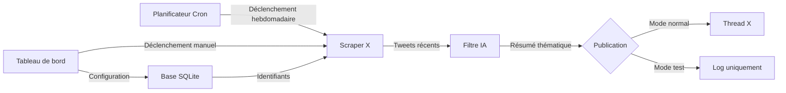
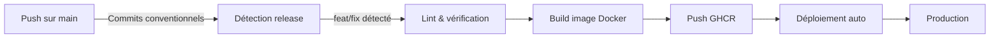

# X AI Weekly Bot

Bot qui scrape automatiquement votre timeline X chaque semaine, extrait les actualités liées à l'IA, génère un résumé via GitHub Models et le publie sous forme de thread X. Interface web incluse pour la configuration et le suivi.

## Table des matières

- [À quoi sert ce produit ?](#à-quoi-sert-ce-produit-)
- [Fonctionnalités principales](#fonctionnalités-principales)
- [Comment ça fonctionne](#comment-ça-fonctionne)
- [Environnements](#environnements)
- [Configuration](#configuration)
- [Développement local](#développement-local)
- [Déploiement](#déploiement)
- [Stack technique](#stack-technique)

## À quoi sert ce produit ?

- **Veille IA automatisée** — Plus besoin de parcourir X manuellement pour suivre l'actualité IA
- **Résumés intelligents** — L'IA filtre, regroupe par thème et résume les tweets pertinents en français
- **Publication automatique** — Le résumé est publié chaque semaine sous forme de thread X
- **Tableau de bord** — Interface web pour configurer, déclencher manuellement et consulter l'historique
- **Zéro maintenance** — Tourne en continu via Docker avec détection automatique des changements d'API X

## Fonctionnalités principales

- **Scraping de timeline** — Récupère les tweets de votre fil d'actualité via l'API web de X (sans clé API officielle)
- **Filtrage IA** — Identifie les tweets liés à l'IA grâce à GitHub Models
- **Résumé thématique** — Regroupe les actualités par thème et génère un résumé en français
- **Publication de threads** — Découpe et publie le résumé en tweets de 280 caractères
- **Tableau de bord temps réel** — Statut, historique des exécutions, déclenchement manuel
- **Assistant de configuration** — Interface guidée pour renseigner vos identifiants
- **Détection automatique des IDs GraphQL** — S'adapte quand X modifie ses endpoints internes
- **Planification configurable** — Cron modifiable depuis l'interface (défaut : dimanche 18h UTC)

## Comment ça fonctionne



Le planificateur déclenche chaque semaine le scraping de votre timeline X. Les tweets sont envoyés à GitHub Models pour filtrer les actualités IA. Le résumé est publié en thread ou simplement loggé en mode test. Le tableau de bord permet de tout piloter depuis le navigateur.

## Environnements

| Environnement | URL                     | Description                                         |
| ------------- | ----------------------- | --------------------------------------------------- |
| Développement | `http://localhost:3000` | Environnement local                                 |
| Production    | Container Docker        | Déployé via GitHub Actions sur serveur auto-hébergé |

## Configuration

### Identifiants requis

| Variable               | Description                        | Comment l'obtenir                                                |
| ---------------------- | ---------------------------------- | ---------------------------------------------------------------- |
| `X_USERNAME`           | Nom d'utilisateur X (sans @)       | Votre profil X                                                   |
| `X_SESSION_AUTH_TOKEN` | Cookie de session X                | DevTools → Cookies → `auth_token`                                |
| `X_SESSION_CSRF_TOKEN` | Token CSRF X                       | DevTools → Cookies → `ct0`                                       |
| `GITHUB_TOKEN`         | Token GitHub (scope `models:read`) | [github.com/settings/tokens](https://github.com/settings/tokens) |

### Variables optionnelles

| Variable               | Défaut           | Description                                                    |
| ---------------------- | ---------------- | -------------------------------------------------------------- |
| `AI_MODEL`             | `openai/gpt-4.1` | Modèle IA ([catalogue](https://github.com/marketplace/models)) |
| `TWEETS_LOOKBACK_DAYS` | `7`              | Nombre de jours à scanner                                      |
| `DRY_RUN`              | `false`          | Mode test (ne publie pas sur X)                                |
| `CRON_SCHEDULE`        | `0 18 * * 0`     | Expression cron du planificateur                               |
| `ADMIN_PASSWORD`       | —                | Mot de passe pour le tableau de bord                           |
| `WEB_PORT`             | `3000`           | Port du serveur web                                            |
| `DB_PATH`              | `./data/bot.db`  | Chemin de la base SQLite                                       |

Les identifiants peuvent aussi être renseignés depuis l'interface web (assistant de configuration).

## Développement local

```bash
cp .env.example .env     # Remplir les variables
npm install              # Installer les dépendances
npm run build            # Compiler backend + frontend
DRY_RUN=true npm run dev # Lancer en mode test
```

## Déploiement



Le pipeline CI/CD (Intégration et Déploiement Continus) se déclenche à chaque push sur `main`. Il analyse les commits conventionnels pour déterminer le type de version (majeure, mineure, correctif). L'image Docker est construite et publiée sur GitHub Container Registry, puis déployée automatiquement via un runner auto-hébergé.

### Production

```bash
# Sur le serveur, dans /opt/docker/x-ai-weekly-bot/
cp .env.example .env
docker compose pull
docker compose up -d
```

## Stack technique

- **Backend :** Node.js 24, Hono, TypeScript
- **Base de données :** SQLite (better-sqlite3, mode WAL)
- **IA :** GitHub Models (API compatible OpenAI)
- **Frontend :** React 19, React Router 7, Tailwind CSS 4, Radix UI
- **Infrastructure :** Docker, GitHub Actions, GitHub Container Registry
