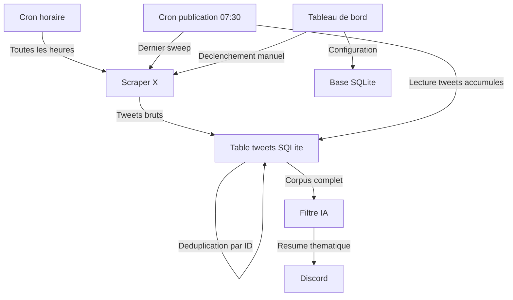
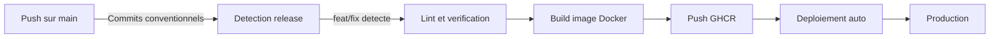

# X AI Weekly Bot

Bot de veille IA automatisee qui scrape votre timeline X toutes les heures, accumule les tweets pertinents et publie un resume quotidien en francais via Discord. Interface web incluse pour la configuration et le suivi.

## Table des matieres

- [A quoi sert ce produit ?](#a-quoi-sert-ce-produit-)
- [Fonctionnalites principales](#fonctionnalites-principales)
- [Comment ca fonctionne](#comment-ca-fonctionne)
- [Environnements](#environnements)
- [Configuration](#configuration)
- [Developpement local](#developpement-local)
- [Deploiement](#deploiement)
- [Stack technique](#stack-technique)
- [Documentation complementaire](#documentation-complementaire)

### Documentation technique

| Document | Description |
|----------|-------------|
| [Reference API](docs/api-reference.md) | Endpoints REST du serveur backend |
| [Integration Discord](docs/discord-integration.md) | Configuration et utilisation des notifications Discord |
| [ADR-0001 : Collecte horaire](docs/adr/0001-hourly-collect-daily-publish-architecture.md) | Decision d'architecture : separation collecte horaire et publication quotidienne |

## A quoi sert ce produit ?

- **Veille IA automatisee** — Plus besoin de parcourir X manuellement pour suivre l'actualite IA et tech
- **Couverture 24h** — Le bot collecte les tweets toutes les heures pour ne rien manquer
- **Resumes intelligents** — L'IA filtre, regroupe par theme et resume les tweets pertinents en francais
- **Notification Discord** — Le resume quotidien est envoye automatiquement sur votre serveur Discord
- **Syntheses mensuelles** — Agregation des resumes quotidiens en vue d'ensemble mensuelle
- **Tableau de bord** — Interface web pour configurer, declencher manuellement et consulter l'historique

## Fonctionnalites principales

- **Collecte horaire de tweets** — Scrape la timeline toutes les heures et stocke les tweets avec deduplication automatique
- **Resume quotidien a 07:30** — Un seul appel IA par jour sur tout le corpus accumule
- **Filtrage IA** — Identifie les tweets lies a l'IA et la tech grace a GitHub Models
- **Resume thematique** — Regroupe les actualites par theme et genere un resume en francais (max 2000 caracteres)
- **Notification Discord** — Envoi automatique ou manuel du resume sur Discord
- **Synthese mensuelle** — Agregation des resumes quotidiens en vue d'ensemble
- **Tableau de bord temps reel** — Statut, historique des executions, declenchement manuel
- **Assistant de configuration** — Interface guidee pour renseigner vos identifiants
- **Detection automatique des IDs GraphQL** — S'adapte quand X modifie ses endpoints internes
- **Planification configurable** — Crons de collecte et publication modifiables depuis l'interface

## Comment ca fonctionne



Le bot fonctionne en deux phases independantes :

- **Collecte horaire** — Toutes les heures, le scraper recupere les tweets de votre timeline X et les stocke en base. Les doublons sont elimines automatiquement.
- **Publication a 07:30** — Un dernier sweep est effectue, puis tous les tweets accumules sont envoyes a l'IA pour generer un resume. Le resultat est publie sur Discord.

Cette architecture offre 24 fois plus de couverture qu'une execution unique, pour le meme cout IA.

## Environnements

| Environnement | URL | Description |
|---------------|-----|-------------|
| Developpement | `http://localhost:3000` | Environnement local |
| Production | Container Docker | Deploye via GitHub Actions sur serveur auto-heberge |

## Configuration

### Identifiants requis

| Variable | Description | Comment l'obtenir |
|----------|-------------|-------------------|
| `X_USERNAME` | Nom d'utilisateur X (sans @) | Votre profil X |
| `X_SESSION_AUTH_TOKEN` | Cookie de session X | DevTools > Cookies > `auth_token` |
| `X_SESSION_CSRF_TOKEN` | Token CSRF X | DevTools > Cookies > `ct0` |
| `GITHUB_TOKEN` | Token GitHub (scope `models:read`) | [github.com/settings/tokens](https://github.com/settings/tokens) |

### Variables optionnelles

| Variable | Defaut | Description |
|----------|--------|-------------|
| `AI_MODEL` | `openai/gpt-4.1` | Modele IA ([catalogue](https://github.com/marketplace/models)) |
| `TWEETS_LOOKBACK_DAYS` | `1` | Nombre de jours a scanner |
| `DRY_RUN` | `false` | Mode test (ne publie pas) |
| `CRON_SCHEDULE` | `30 7 * * *` | Cron de publication (07:30 par defaut) |
| `COLLECT_CRON_SCHEDULE` | `0 * * * *` | Cron de collecte (toutes les heures par defaut) |
| `DISCORD_WEBHOOK_URL` | — | URL du webhook Discord pour les notifications |
| `ADMIN_PASSWORD` | — | Mot de passe pour le tableau de bord |
| `WEB_PORT` | `3000` | Port du serveur web |
| `DB_PATH` | `./data/bot.db` | Chemin de la base SQLite |

Les identifiants peuvent aussi etre renseignes depuis l'interface web (assistant de configuration).

## Developpement local

```bash
cp .env.example .env     # Remplir les variables
npm install              # Installer les dependances
npm run build            # Compiler backend + frontend
DRY_RUN=true npm run dev # Lancer en mode test
```

## Deploiement



Le pipeline CI/CD (Integration et Deploiement Continus) se declenche a chaque push sur `main`. Il analyse les commits conventionnels pour determiner le type de version (majeure, mineure, correctif). L'image Docker est construite et publiee sur GitHub Container Registry, puis deployee automatiquement via un runner auto-heberge.

### Production

```bash
# Sur le serveur, dans /opt/docker/x-ai-weekly-bot/
cp .env.example .env
docker compose pull
docker compose up -d
```

## Stack technique

- **Backend :** Node.js 24, Hono v4, TypeScript (mode strict)
- **Base de donnees :** SQLite (better-sqlite3, mode WAL)
- **IA :** GitHub Models (SDK OpenAI v6)
- **Frontend :** React 19, React Router 7, Tailwind CSS 4, Radix UI
- **Infrastructure :** Docker, GitHub Actions, GitHub Container Registry

## Documentation complementaire

| Document | Description |
|----------|-------------|
| [Reference API](docs/api-reference.md) | Endpoints REST du serveur backend |
| [Integration Discord](docs/discord-integration.md) | Configuration et utilisation des notifications Discord |
| [ADR-0001 : Collecte horaire](docs/adr/0001-hourly-collect-daily-publish-architecture.md) | Decision d'architecture : separation collecte horaire et publication quotidienne |
| [CLAUDE.md](CLAUDE.md) | Instructions pour Claude Code (conventions, structure, commandes) |
| [AGENT.md](AGENT.md) | Reference rapide pour les agents autonomes |
