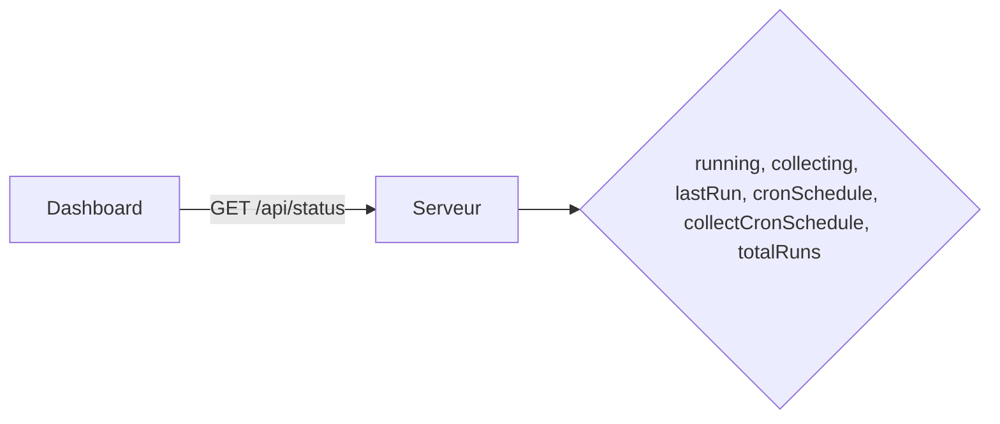
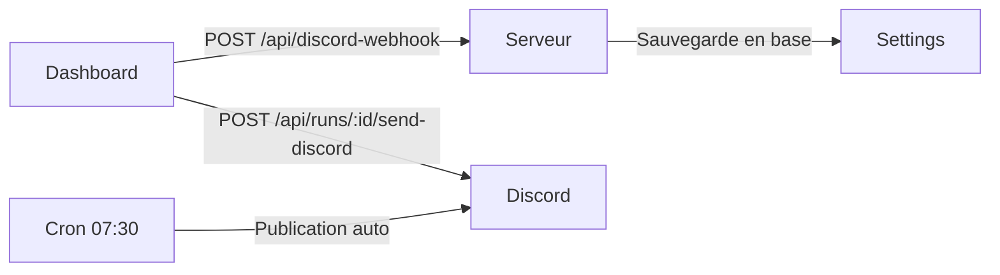

# Reference API

Reference des endpoints REST exposes par le serveur backend Hono. Ce document s'adresse aux developpeurs et integrateurs.

## Authentification

Si `ADMIN_PASSWORD` est configure, toutes les routes sont protegees par **Basic Auth** (`admin` / mot de passe).

## Sante et version

| Methode | Route | Description |
|---------|-------|-------------|
| GET | `/healthz` | Verification de sante (sans auth) |
| GET | `/api/version` | Version et date de build |

**`GET /healthz`** — Retourne `{ "status": "ok" }` si configure, ou `503` avec la liste des cles manquantes.

**`GET /api/version`** — Retourne la version de l'application et la date de build.

## Statut et configuration

| Methode | Route | Description |
|---------|-------|-------------|
| GET | `/api/status` | Statut global du bot |
| GET | `/api/setup` | Etat de la configuration initiale |
| GET | `/api/config` | Valeurs par defaut et identifiants masques |
| GET | `/api/settings` | Liste des parametres en base |
| POST | `/api/settings` | Modifier les parametres editables |

**`GET /api/status`** — Retourne l'etat courant du bot.

Le champ `running` indique si une publication est en cours. Le champ `collecting` indique si une collecte est en cours. Les deux operations sont independantes.

**`POST /api/settings`** — Accepte un objet JSON avec les cles editables :
- `AI_MODEL`, `TWEETS_LOOKBACK_DAYS`, `DRY_RUN`
- `CRON_SCHEDULE`, `COLLECT_CRON_SCHEDULE`
- `X_GQL_USER_BY_SCREEN_NAME_ID`, `X_GQL_HOME_TIMELINE_ID`

## Executions (runs)

| Methode | Route | Description |
|---------|-------|-------------|
| GET | `/api/runs` | Historique des executions |
| POST | `/api/trigger` | Declenchement manuel (publication) |
| POST | `/api/trigger-collect` | Declenchement manuel (collecte) |

**`GET /api/runs?limit=20&type=cron`** — Retourne les dernieres executions. Le parametre `type` filtre par type : `collect`, `cron` ou `manual`.

**`POST /api/trigger`** — Lance un run de publication (resume IA + Discord). Refuse si un run est deja en cours.

**`POST /api/trigger-collect`** — Lance une collecte de tweets. Refuse si une collecte est deja en cours. N'affecte pas les runs de publication.

## Collecte de tweets

| Methode | Route | Description |
|---------|-------|-------------|
| GET | `/api/collect-status` | Statut de la collecte du jour |

**`GET /api/collect-status`** — Retourne le nombre de tweets collectes et non publies pour la date du jour (fuseau Europe/Paris).

Reponse :
- `collecting` — collecte en cours (booleen)
- `today` — date du jour au format `YYYY-MM-DD`
- `tweetsCollected` — total de tweets pour le jour
- `tweetsUnpublished` — tweets pas encore utilises dans un resume

## Planification cron

| Methode | Route | Description |
|---------|-------|-------------|
| GET | `/api/cron-schedule` | Planifications actives (publication + collecte) |
| POST | `/api/cron-schedule` | Modifier le cron de publication |
| POST | `/api/collect-cron-schedule` | Modifier le cron de collecte |

**`GET /api/cron-schedule`** — Retourne les planifications actives, sauvegardees et par defaut pour la publication et la collecte.

**`POST /api/cron-schedule`** — Modifie le cron de publication et l'applique immediatement (hot-reload).

**`POST /api/collect-cron-schedule`** — Modifie le cron de collecte et l'applique immediatement.

Les deux acceptent `{ "schedule": "30 7 * * *" }`. L'expression cron est validee avant application.

## Resumes

| Methode | Route | Description |
|---------|-------|-------------|
| GET | `/api/summaries` | Resumes quotidiens pagines |
| GET | `/api/monthly-summaries` | Syntheses mensuelles |
| GET | `/api/monthly-summaries/available` | Mois avec des donnees |
| GET | `/api/monthly-summaries/:year/:month` | Synthese d'un mois |
| POST | `/api/monthly-summaries/generate` | Generer une synthese mensuelle |

**`GET /api/summaries?limit=20&offset=0`** — Retourne les resumes quotidiens avec pagination.

**`POST /api/monthly-summaries/generate`** — Genere une synthese IA a partir des resumes quotidiens du mois. Accepte `{ "year": 2026, "month": 3 }`.

## Discord

| Methode | Route | Description |
|---------|-------|-------------|
| POST | `/api/discord-webhook` | Sauvegarder l'URL du webhook |
| DELETE | `/api/discord-webhook` | Supprimer le webhook |
| POST | `/api/test-discord` | Envoyer un message de test |
| POST | `/api/runs/:id/send-discord` | Envoyer un resume sur Discord |

**`POST /api/discord-webhook`** — Sauvegarde l'URL du webhook. L'URL doit commencer par `https://discord.com/api/webhooks/`.

**`POST /api/runs/:id/send-discord`** — Envoie manuellement le resume d'un run sur Discord. Met a jour le `notification_status` du run.

## Identifiants X

| Methode | Route | Description |
|---------|-------|-------------|
| POST | `/api/credentials` | Mettre a jour les cookies X |
| POST | `/api/detect-gql-ids` | Detecter les IDs GraphQL |

**`POST /api/credentials`** — Valide et sauvegarde les cookies `auth_token` et `ct0`. Les cookies sont verifies aupres de X avant sauvegarde.

**`POST /api/detect-gql-ids`** — Analyse les bundles JavaScript de x.com pour extraire les IDs d'operation GraphQL actuels. Utile quand X modifie ses endpoints.

## Protection CSRF

Les requetes POST/PUT/DELETE sont protegees par verification de l'en-tete `Origin` ou `Referer`. Les outils en ligne de commande (curl, etc.) sans ces en-tetes sont autorises.
