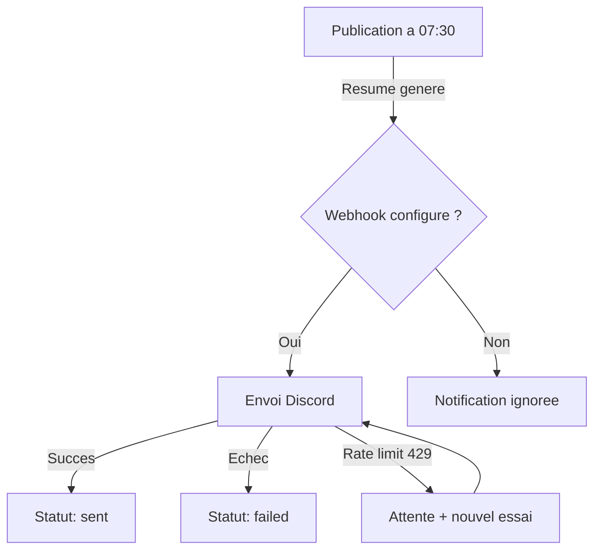

# Integration Discord

Ce document explique comment configurer et utiliser les notifications Discord. Il s'adresse aux utilisateurs et administrateurs du bot.

## A quoi ca sert ?

Le bot envoie automatiquement le resume quotidien IA & Tech sur un canal Discord de votre choix. Vous pouvez aussi envoyer manuellement un resume depuis le tableau de bord.

## Configuration

### Creer un webhook Discord

1. Ouvrez les **parametres du canal** Discord souhaite
2. Allez dans **Integrations** > **Webhooks**
3. Cliquez sur **Nouveau webhook**
4. Donnez-lui un nom (ex: "Veille IA Bot")
5. Copiez l'**URL du webhook**

L'URL ressemble a : `https://discord.com/api/webhooks/123456789/abcdef...`

### Enregistrer le webhook dans le bot

Deux options :

- **Via le tableau de bord** — Page Parametres, section Discord, collez l'URL
- **Via la variable d'environnement** — Ajoutez `DISCORD_WEBHOOK_URL` dans `.env`

L'URL est sauvegardee en base de donnees et masquee dans l'interface (seuls les 4 derniers caracteres sont visibles).

## Fonctionnement

Le bot envoie la notification apres chaque publication reussie. Le processus est asynchrone : il ne bloque pas le run en cours.

### Envoi automatique

- Se declenche apres chaque run de publication (`cron` ou `manual`) avec un resume
- Si le webhook n'est pas configure, le statut de notification est marque `skipped`
- En cas d'echec, le statut est `failed` et l'erreur est journalisee

### Envoi manuel

Depuis le tableau de bord, vous pouvez renvoyer le resume de n'importe quel run sur Discord via le bouton d'envoi.

### Message de test

Le bouton de test envoie un court message de verification sur le canal configure. Utilisez-le pour valider que l'URL est correcte.

## Format du message

Le resume est envoye sous forme d'**embed Discord** avec :

- **Titre** — "Veille IA & Tech quotidienne"
- **Contenu** — Le resume thematique en francais (max 4096 caracteres)
- **Couleur** — Bleu X/Twitter (#1D9BF0)
- **Pied de page** — Numero du run (ex: "Run #42")
- **Horodatage** — Date et heure d'envoi

## Securite

- Les mentions (`@everyone`, `@here`, mentions d'utilisateurs) sont **neutralisees** automatiquement
- Le parametre `allowed_mentions` est vide : aucune mention ne sera declenchee
- L'URL du webhook est **masquee** dans l'interface et les logs

## Gestion des erreurs

| Situation | Comportement |
|-----------|-------------|
| Webhook non configure | Notification ignoree (`skipped`) |
| Erreur reseau | Notification echouee (`failed`), erreur journalisee |
| Rate limit Discord (HTTP 429) | Attente selon l'en-tete `Retry-After` (max 30s), puis nouvel essai |
| Deuxieme echec apres retry | Notification echouee (`failed`) |

## Endpoints API associes

| Route | Description |
|-------|-------------|
| `POST /api/discord-webhook` | Sauvegarder l'URL |
| `DELETE /api/discord-webhook` | Supprimer l'URL |
| `POST /api/test-discord` | Message de test |
| `POST /api/runs/:id/send-discord` | Envoi manuel d'un resume |

> **Detail technique** — Voir [docs/api-reference.md](api-reference.md) pour les formats de requete et reponse detailles.
